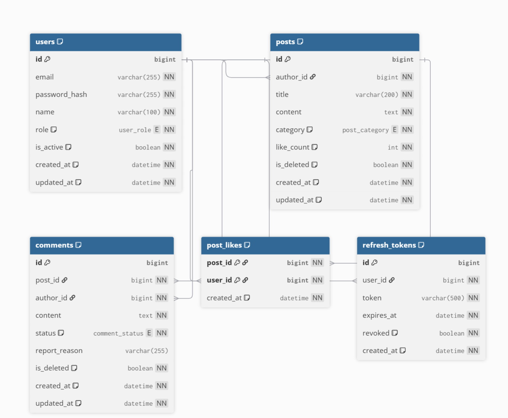

# Web Service API Server

Node.js + Express 기반의 REST API 서버입니다.  
JWT 인증을 기반으로 사용자, 게시글, 댓글 기능을 제공합니다.

---

## 주요 기능

- JWT 인증 / 인가 (Access Token, Refresh Token)
- 사용자(User) 관리
- 게시글(Post) 관리
- 댓글(Comment) 관리
- 게시글 좋아요(PostLike)
- 공통 에러 응답 규격
- Swagger(OpenAPI 3.0) 자동 문서화
- Postman 테스트 컬렉션 제공

---

## 기술 스택

- **Backend**: Node.js, Express.js  
- **ORM**: Sequelize  
- **Database**: MySQL 8.0 (Docker)  
- **Authentication**: JWT (Access / Refresh Token)  
- **API Docs**: Swagger (OpenAPI 3.0)  
- **Process Manager**: PM2  
- **Deployment**: JCloud (Ubuntu)

--

배포 정보 (JCloud)

Base URL: http://113.198.66.68:13137

Health Check: GET http://113.198.66.68:13137/health

Swagger UI: http://113.198.66.68:13137/swagger-ui

실행 방법
1) 로컬 실행 (개발)
npm install
npm run dev

기본적으로 .env 설정이 필요합니다. (.env.example 참고)

2) 서버 실행 (운영/배포: PM2)
npm install
pm2 start src/app.js --name webservice-hw
pm2 save

프로세스 관리 (PM2)
pm2 list
pm2 restart webservice-hw
pm2 logs webservice-hw
pm2 stop webservice-hw
pm2 delete webservice-hw

DB (MySQL, Docker)

JCloud에서는 MySQL이 Docker 컨테이너로 실행되며, 볼륨을 사용해 데이터가 유지됩니다.

DB 상태 확인
docker ps
docker volume ls

환경 변수

.env.example 참고해서 .env를 구성합니다.

인증 플로우 (JWT)
1) 회원가입

POST /auth/register

2) 로그인

POST /auth/login
→ Access Token / Refresh Token 발급

3) 인증 필요한 요청

요청 헤더에 아래 형식으로 포함:

Authorization: Bearer <ACCESS_TOKEN>

4) 토큰 재발급

POST /auth/refresh

5) 로그아웃

POST /auth/logout

권한(Role)

USER: 일반 사용자

ADMIN: 관리자

관리자 전용 API 예시:

GET /users

GET /users/{id}

PATCH /users/{id}/deactivate

PATCH /users/{id}/role

GET /stats/*

엔드포인트

Swagger UI: http://113.198.66.68:13137/swagger-ui

공통 에러 응답 형식
{
  "timestamp": "2025-12-14T12:00:00Z",
  "path": "/posts/1",
  "status": 404,
  "code": "RESOURCE_NOT_FOUND",
  "message": "Resource not found",
  "details": {}
}

Postman 컬렉션

Postman Collection(JSON)은 classroom 제공 파일에 포함되어 있습니다.
환경 변수(baseUrl, accessToken)를 설정하여 테스트합니다.

ERD
